# Musec Pico - MUSECA Style Mini Controller
[点这里可以切换到中文版](README_CN.md)

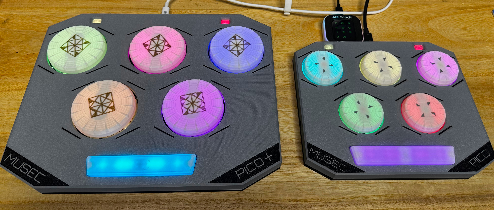

There're two versions. Musec Pico uses 52mm spinners and Musec Pico+ uses 74mm spinners. They have the same structure and function the same.

Features:
* It's small but closely replicates the feel of the arcade controller.
* Built-in "spacebar" pedal.
* External pedal support through the 3.5mm jack.
* Full HID light support.
* Command line for configurations.
* All source files open.

Thanks to many respectful guys/companies who made their tools or materials free or open source (KiCad, OnShape, InkScape, Raspberry things).

Special thanks to community projects and developers.
And also these projects:
* RP_Silicon_KiCad: https://github.com/HeadBoffin/RP_Silicon_KiCad
* Type-C: https://github.com/ai03-2725/Type-C.pretty

## My Other Projects
You can check out my other cool projects.

             

* Popn Pico: https://github.com/whowechina/popn_pico
* IIDX Pico: https://github.com/whowechina/iidx_pico
* IIDX Teeny: https://github.com/whowechina/iidx_teeny
* Chu Pico: https://github.com/whowechina/chu_pico
* Mai Pico: https://github.com/whowechina/mai_pico
* Diva Pico: https://github.com/whowechina/diva_pico
* AIC Pico: https://github.com/whowechina/aic_pico
* Groove Pico: https://github.com/whowechina/groove_pico
* Geki Pico: https://github.com/whowechina/geki_pico
* Musec Pico: https://github.com/whowechina/musec_pico
* Ju Pico: https://github.com/whowechina/ju_pico
* Bishi Pico: https://github.com/whowechina/bishi_pico
* Nos Pico: https://github.com/whowechina/nos_pico

## **Disclaimer** ##
I made this project in my personal time with no financial benefit or sponsorship. I will continue to improve the project. I have done my best to ensure that everything is accurate and functional, there's always a chance that mistakes may occur. I cannot be held responsible for any loss of your time or money that may result from using this open source project. Thank you for your understanding.

## About the License
It's CC-NC. So DIY for yourself and for your friend, don't make money from it. And plagiarism that doesn’t even dare to mention the original author is not acceptable. Plase note that pooling orders and group buying for raw materials is acceptable. Selling off any leftover components without profit is also acceptable.

If you're interested in buying from me or some kind of commercial use, please contact me (Discord, QQ group, Wechat group or leave your contact in issue section).

## My Discord Invitation
https://discord.gg/M8f2PPQFEA

## HOW TO BUILD
### PCB and Components
* Go JLCPCB and make order with the gerber zip files (latest `Production\PCB\musec_pico_xxx.zip` for Musec Pico or `Production\PCB\musec_plus_xxx.zip` for Musec Pico+, and `Procution\PCB\musec_pedal_xxx.zip` for both versions), regular FR-4 board, black or white color, **1.6mm** thickness.  
  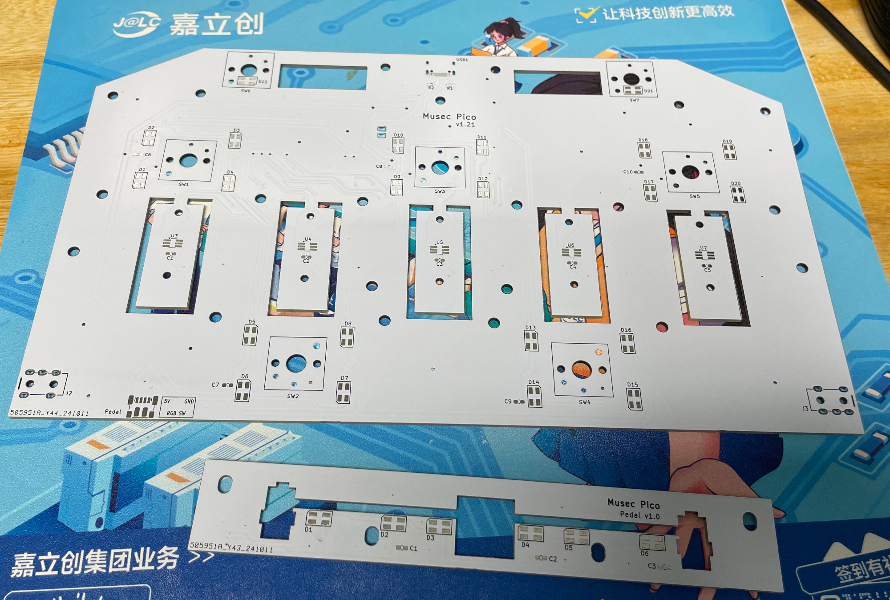
* 1x Rasberry Pico Pi Pico or pin-to-pin compatible clones (U1).  
  https://www.raspberrypi.com/products/raspberry-pi-pico
* 1x USB Type-C socket (918-418K2023S40001 or KH-TYPE-C-16P)
* 28x WS2812B-3528 RGB LEDs (all RGB LEDs).
* 6x TMAG5273A1 or TMAG5273A2, in SOT23-6 (U3 to U7).  
* 12x 0603 0.1uF (0.1~1uF all fine) capacitors (all Capacitors).
* 2x 0603 5.1kohm resistors (R1, R2) for the USB.
* 2x 0603 10ohm resistor, (1-20ohm all work fine) (R3, R4).
* 2x PJ-313 through-hole 3.5mm audio jacks (J2, J3).  
* 12x JST-SH1.0 4-pin right angle SMD connectors (JA1 to JA5, JB1 to JB5, Pedal, J1 on pedal board).  
  https://www.amazon.com/Kidisoii-Connector-Mounting-Vertical-SH1-0-SMT-Ver/dp/B0CQ28CCQG?th=1
* 6x JST-SH1.0 dual-end 4-pin cables, 60mm length * 5, and 100mm length * 1.
   The connector footprint on PCB also supports hand soldering. So if you can't find the connectors or the cables, you can solder the wires directly to the PCB.  
   RC hobby sites often have SH1.0 4P silicone cables, but with only one end connector. You can solder the other end to the PCB. It's still a good choice.
* 7x Kailh Choc v1. Choose heavy ones (70gf), I think the yellow with 70g force is the best.  
  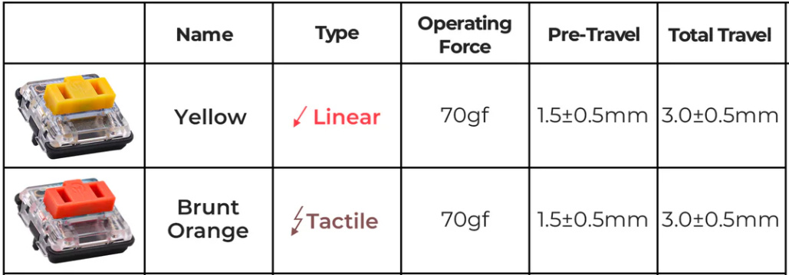
* For Musec Pico+, you can use one switch per button, or 2x switches per button to get more force.  
  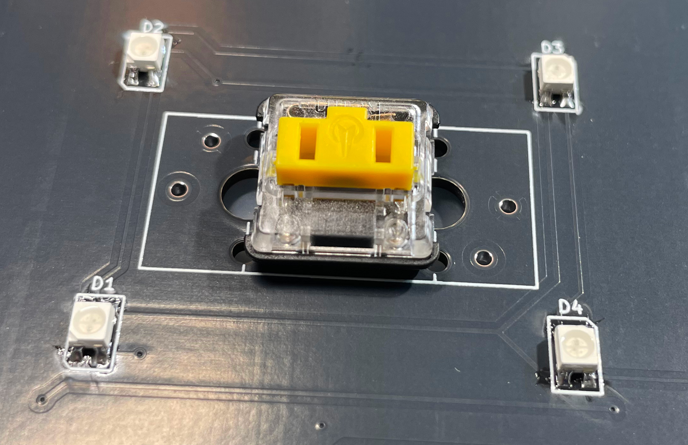 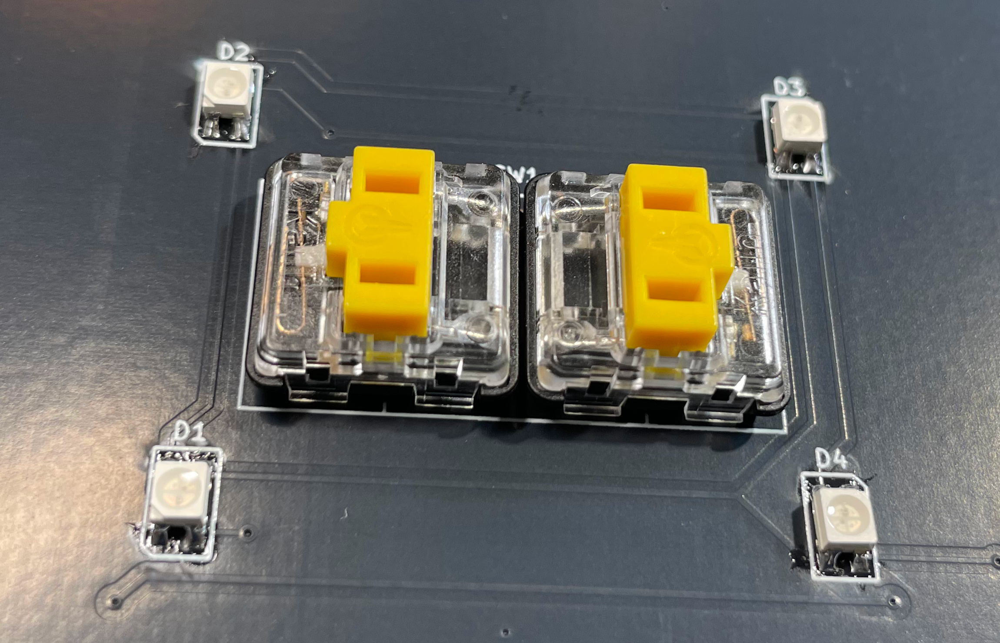
* 1x MX-compatible switch, I personally use Gateron POM CJ BOX.
* 1x Plate-mounting stabilizer for the MX switch, 6.25U.  
  https://www.amazon.com/GATERON-Stabilizer-Mechanical-Keyboard-Satellite/dp/B0C137DG5Q/

* This is how it looks after soldering (there might be changes in newer versions of PCB). I'm only showing the Musec Pico, but the Musec Pico+ is similar.  
  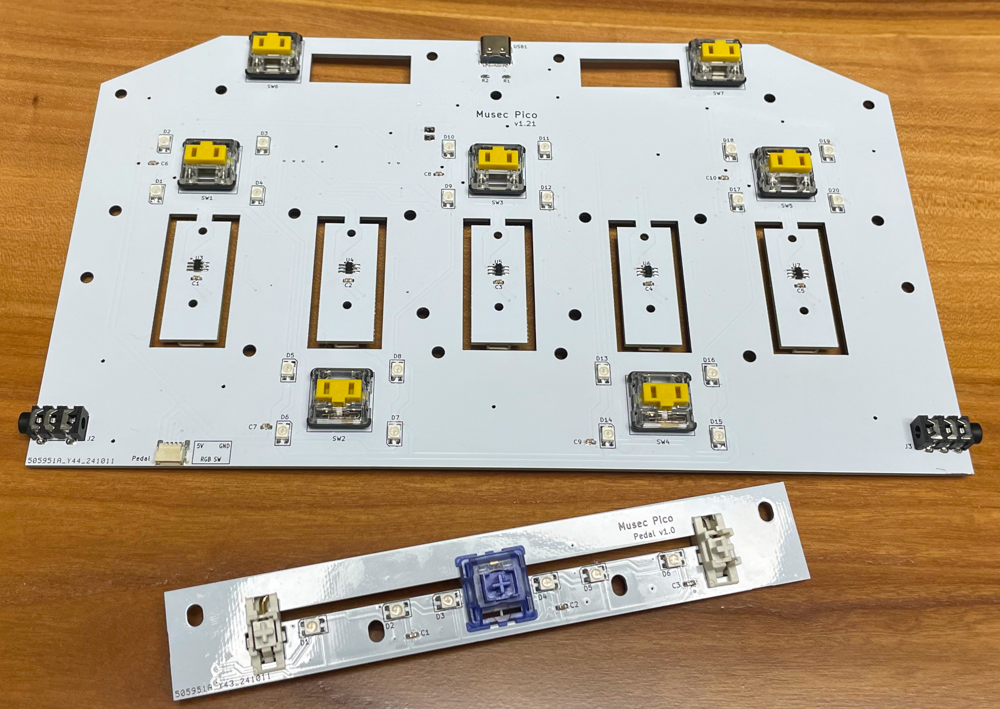  
  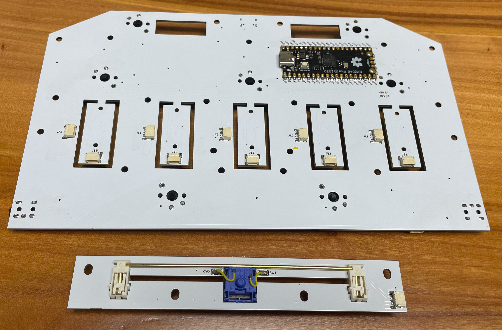
* Becareful of 2 pin holes. It's a common oversight to either forget to solder them or to leave air bubbles during the process. To avoid this, solder slowly from one side of the hole, using minimal solder wire and a generous amount of flux.  
  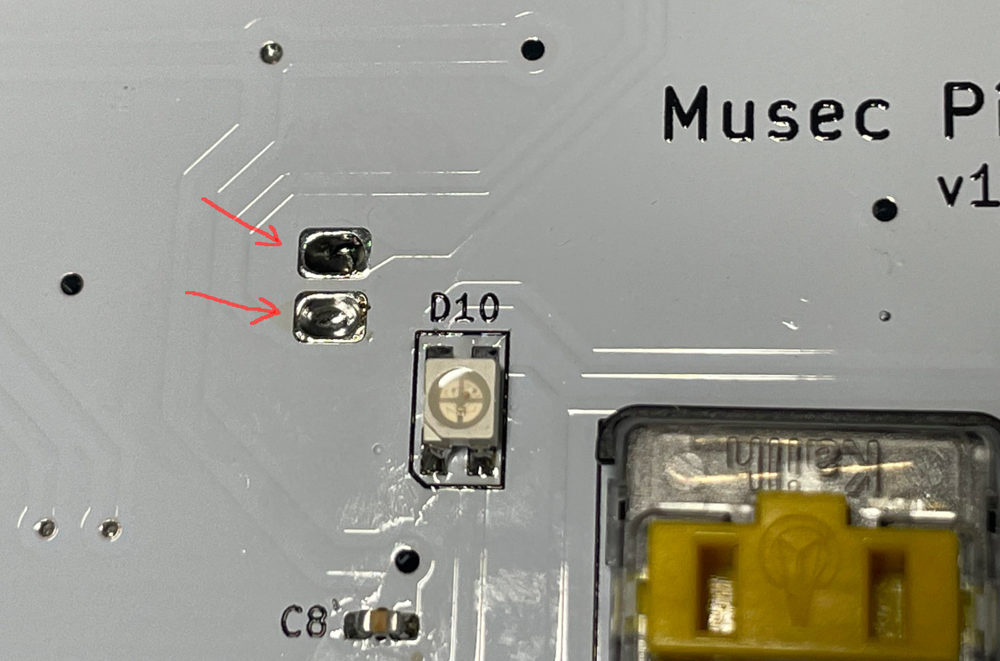

### Test the PCB
* You can test the PCB now, put the firmware in.
* All RGB LEDs should light up in a rainbow pattern.
* LEDs responds to the button presses.
* Musec Pico should be recognized as a USB HID device, here's the test page.  
  https://greggman.github.io/html5-gamepad-test/
* Move a magnetic screwdriver tip close to the TMAG5273 sensor, you'll notice the corresponding axis move in the test page. Please check all 5 sensors.

### Sensor PCB Separation
* If everthing works fine, you can cut off (or even bend and snap) the 5 small sensor boards from the main board.  
  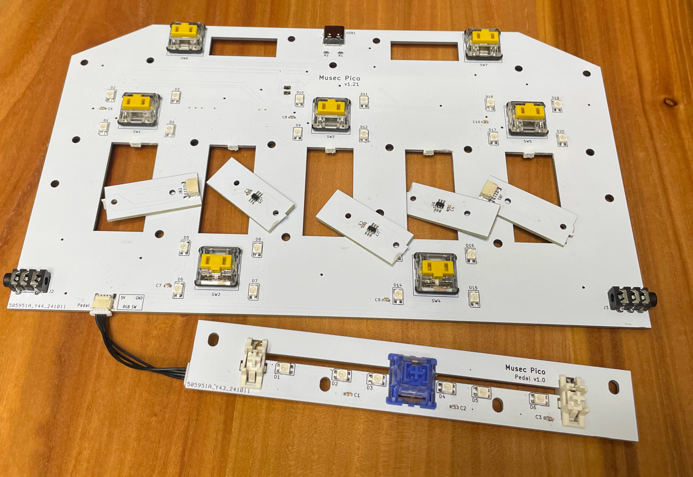

### 3D Printing
The following descriptions are for Musec Pico. If you're making Musec Pico+, please find the corresponding files with `+` in the name.

#### Printing parameters  
* PLA or PETG.
* Layer height: 0.2mm
* Support: Yes, always.
* Glue on bed: Yes, it prevents corner warping.
* Files are always in milimeter unit, not inch.

#### 5x Spinner Parts
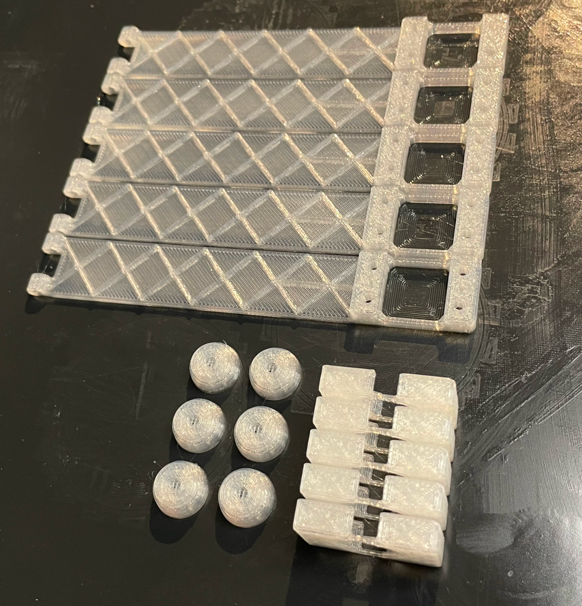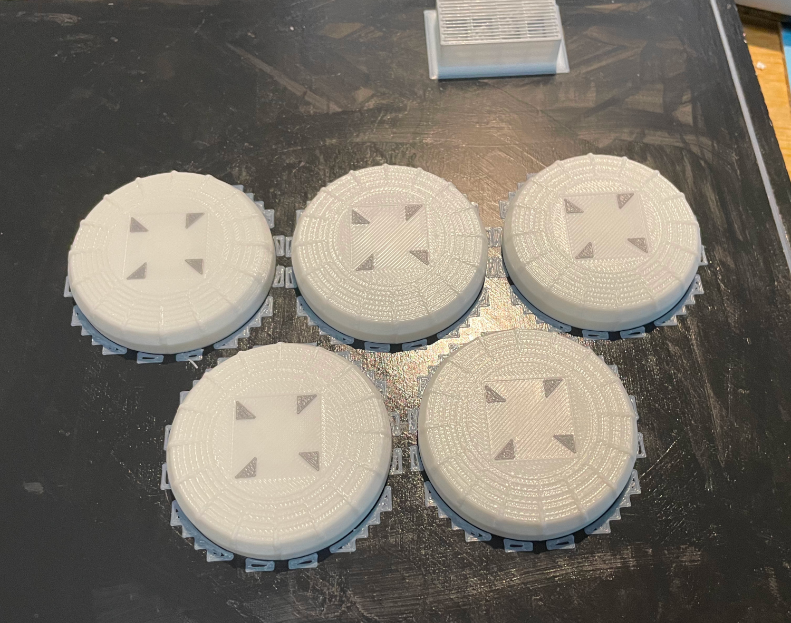

* Keycap: `Production\3DPrint\musec_pico_keycap.stl`, white, 5 walls or >=90% infill. If you have multi-color system, print the 4 triangle marks on the top in gray. 
* Bearing Fixer: `Production\3DPrint\musec_pico_bearing_fixer.stl`, clear transparent.
* Shaft End: `Production\3DPrint\musec_pico_shaft_end_xxx.stl`, clear transparent, choose the one matches your magnet size.
* Lever: `Production\3DPrint\musec_pico_lever.stl`, clear transparent.
* Pad: `Production\3DPrint\musec_pico_pad.stl`, white, gray or black (so it won't affect the LED color).

#### Housing Parts
* Housing Bottom: `Production\3DPrint\musec_pico_bottom.stl`, black, use special support material for nicer screw hole surface.
* Housing Top: `Production\3DPrint\musec_pico_top.3mf`, gray, print up-side-down. If you have multi-color system, print the logo and lines in black.

#### Other Parts
* Pedal: `Production\3DPrint\musec_pico_pedal.stl`, white, print upside down.
* Aux Buttons: `Production\3DPrint\musec_pico_aux.stl`, clear transparent, print upside down.

### Assembly
The following descriptions are for Musec Pico. But Musec Pico+ has the same internal structure, so the assembly is similar.

#### Other components needed
* **M2.5\*6mm screws** (5x for Musec Pico, 15x for Musec Pico+) for fixing the keycap to the bearing.
* 30x **M2\*8mm screws** for fixing the bearing and the sensor PCB to the lever.
* 15x **M3\*8mm screws** for fixing button pads to the bottom housing.
* 16x **M3\*(10-12mm) screws** for fixing the top and bottom housing and the pedal board to the bottom housing.  
* 5x 6700zz (10x15x4mm for Musec Pico), or 6702zz (15x21x4mm, for Musec Pico+) bearings for the spinner, just buy cheapest ones. They may come packed with a heavy weight oil that arrests rotation, this can be corrected by thoroughly degreasing the bearings and relubricating them with a lightweight oil like Super Lube ISO 68. For example, a soak and spin in 99% isopropyl alcohol, dry on a heated plate to remove the excess alcohol and thin and remaining grease, then a final wash in acetone (if you have all-metal bearings) and additional heated dry before relubricating will ensure the bearings spin freely.
  https://www.amazon.com/uxcell-6700ZZ-Groove-Bearings-Shielded/dp/B082PPYZQX/
* 5x round magnets, 5-7mm diameter for Musec Pico, 5mm only for Musec Pico+, 3mm or 4mm also works if you stick it well, 1.5mm or 2mm tall, MUST be radially/diametrically magnetized (N-S poles on the curved side).  
  https://wargameportal.com/products/special-diametrically-magnetized-50pcs-5mm-x-2mm-3-16-x-1-16-disc-magnets?variant=49014932209942
* 5x 2mm diameter steel shafts for the lever, 25mm length for Musec Pico, 40mm length for Musec Pico+.
* For Musec Pico+, you can use 5x 0.4mm\*5mm\*10mm\*6N (wire diameter\*outer diameter\*length\*number of coils) springs to increase the button force.  
* Some good tape (such as acetate tape or high-temp teflon tape) to fix the magnets in place.
* PTFE or UHMW tape for the sliding surfaces.
* Silicone anti-slip pads for the bottom.  
  
* Optional but good to have: plastic washer (ring pads), 0.5mm thick, 2.1~2.5mm inner diameter, 5-10mm outer diameter.  
  https://www.amazon.com/Bclla-Zkenshan-washers-Shock-Proof-Leak-Proof-Insulation/dp/B091Y7H9NX/
* Optional but good to have: A digital piano or music keyboard sustain pedal or a sewing machine pedal with 3.5mm jack. If it comes with 6.25mm jack, you also need a 6.25mm to 3.5mm adapter.

#### Steps
1. We'll start with the spinner part.  
   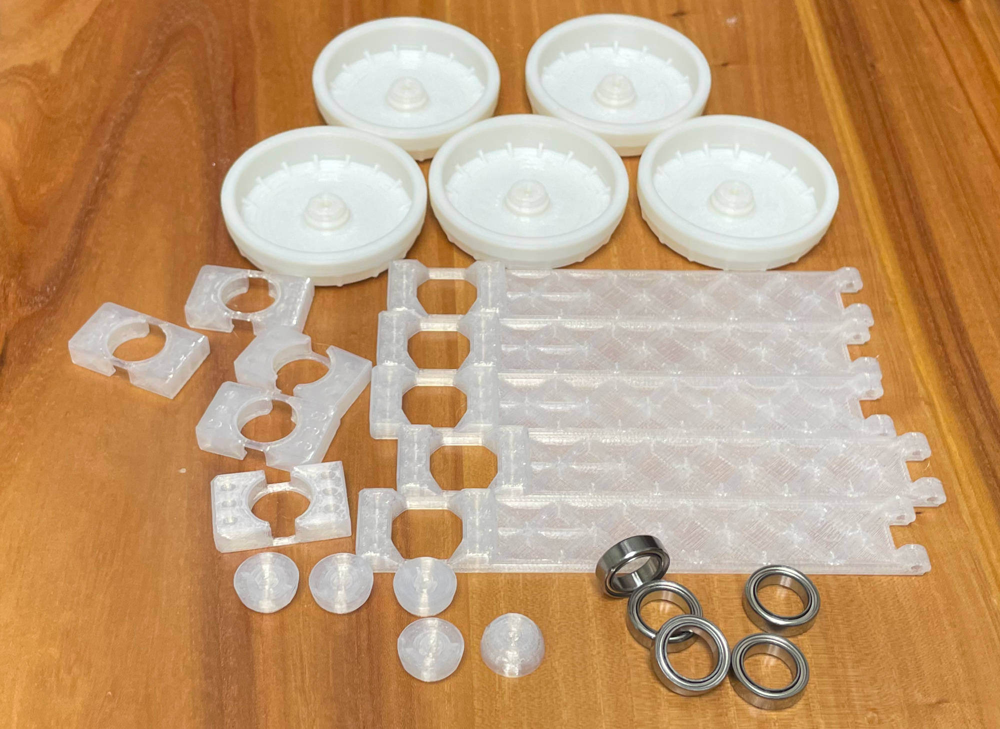

2. Put the bearing into the bearing fixer, you'll need to bend the fixer a little bit to insert the bearing. Don't worry if the small connection part of the fixer breaks, it's fine. Then screw the bearing fixer to the lever.  
   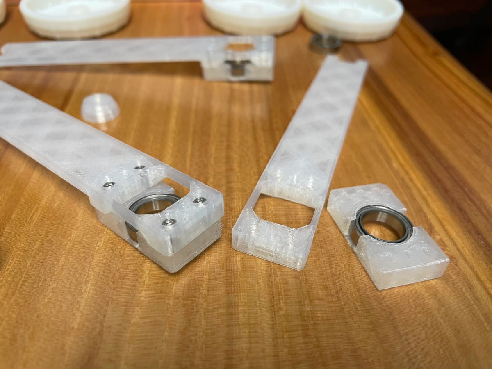

3. Screw the keycap using M2.5 screws mentioned earlier.  
   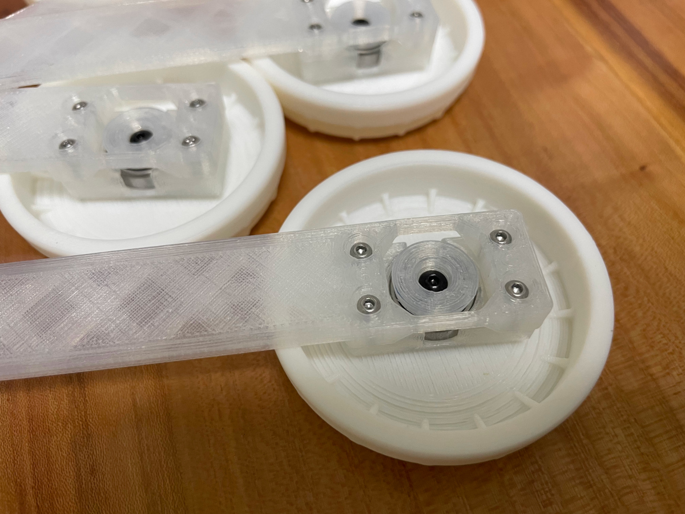

4. Now insert the magnet into the slot at the center. It will be attracted to the screw head. But we still need some tape to fix it in place.  
   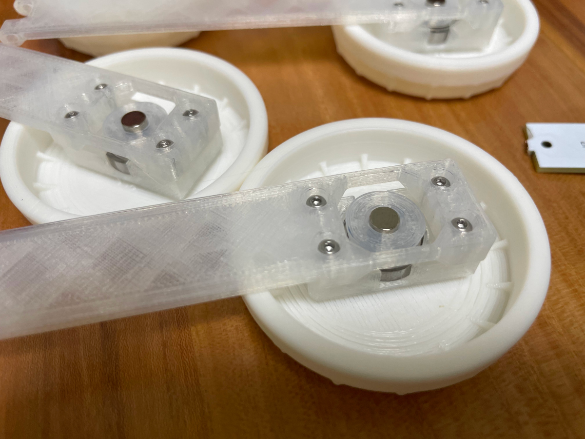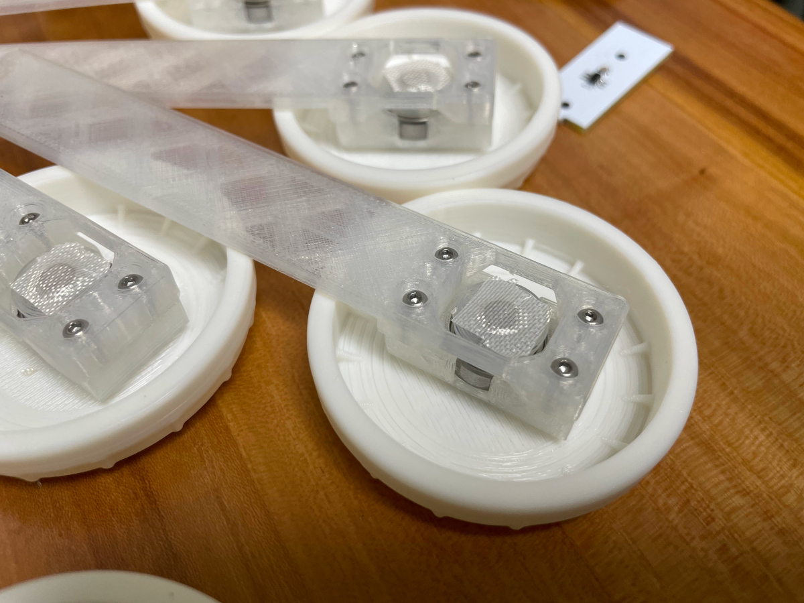

5. Screw the sensor PCB to the lever and put a small piece of thin PTFE/UHMW tape on the surface. And lastly insert the shaft into the lever.  
   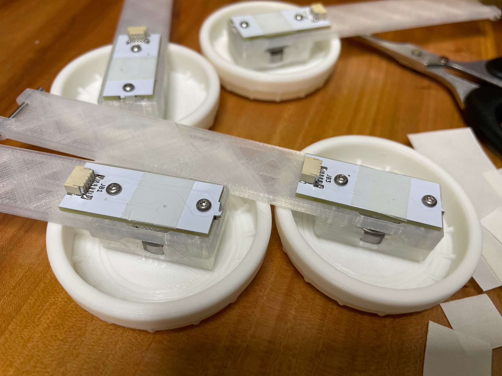

6. Connect 5 SH1.0 cables to the main PCB. Install the main PCB and the pedal PCB to the bottom housing. Use another SH1.0 cable to connect the pedal PCB and the main PCB. The screwholes on pedal board is adjustable. Normally you need to install the pedal board a little higher.    
   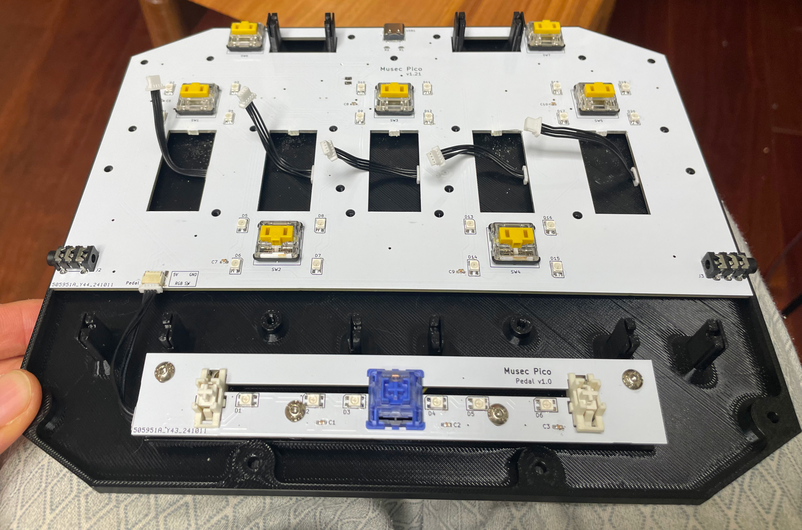

7. Connect the SH1.0 cables which are already connected to the main board to the sensor PCBs. And then push the lever shafts into the stands on the bottom housing. If you have keyboard lubricant, you can apply some to the shaft and the stand.  
   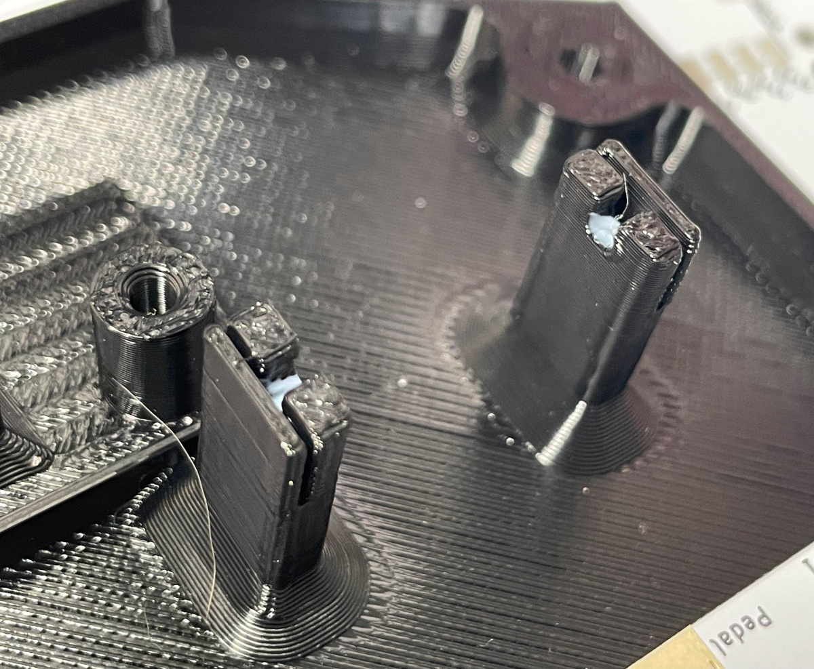  
   A pair of plastic washer will be helpful to prevent the lever from moving. They can also be used to adjust the lever position, compensating for the printing tolerance.  
   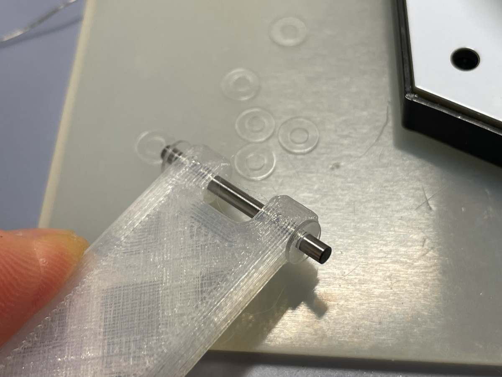  
   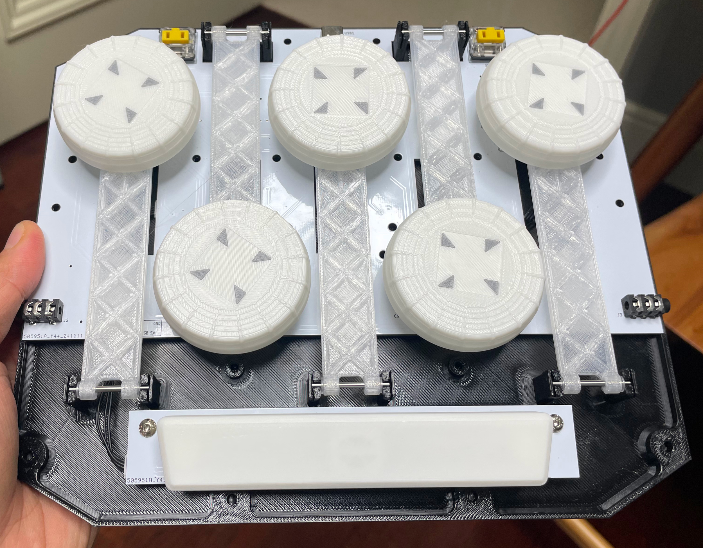

8. Install the button pads using M3*8mm screws.  
   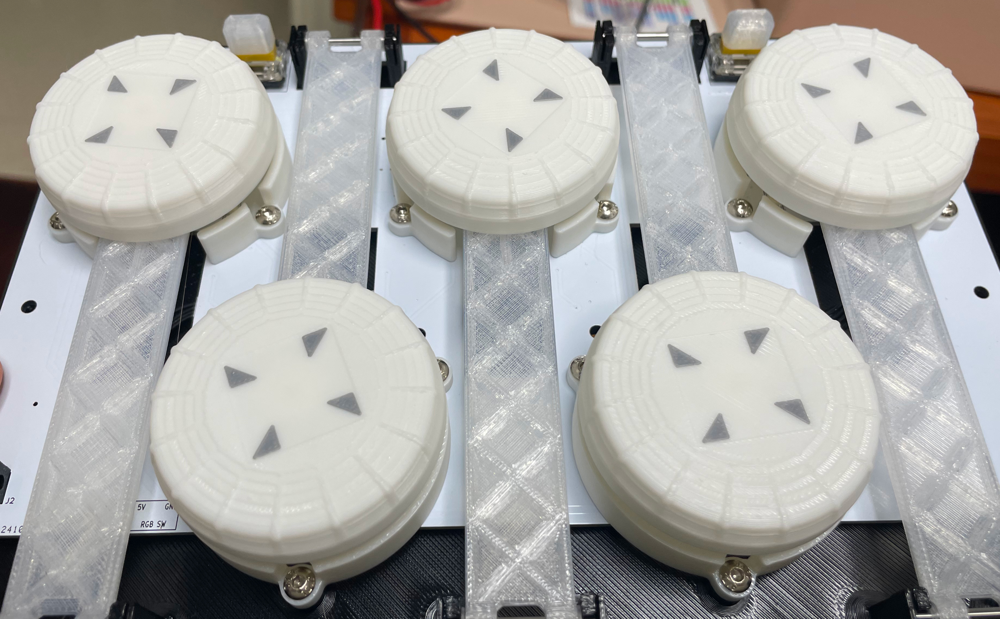

9. Only for Musec Pico+, you can put springs onto the spring seats.

10. Install the top housing, you need to screw many M3 screws.  
   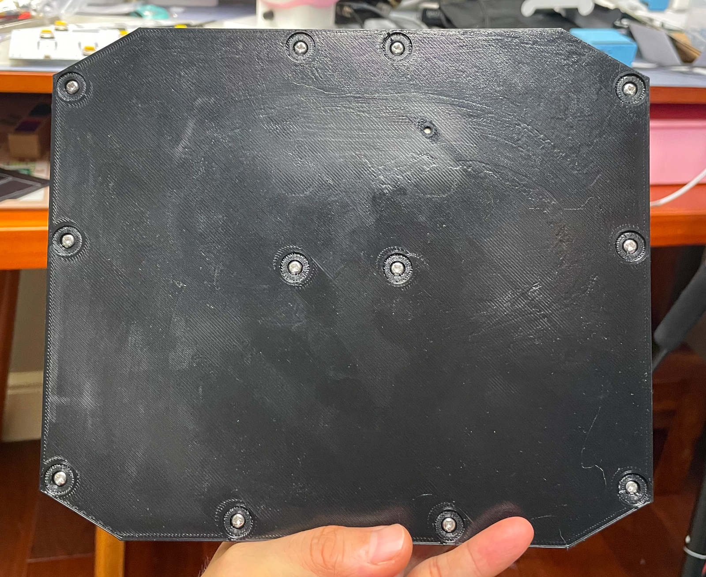

11. Put the anti-slip pads on the bottom, right on top of the screws.  

#### Caution
* Each 3D printer and filament has its own tolerance. If you find the stem holes on the pedal keycap are too tight, use some needle or knife to enlarge them a little bit.
* Screws are easy to break the 3D printed parts. So don't screw them too tight. When you notice the resistance suddenly increases, stop screwing.

### Firmware
* UF2 file is in `Production\Firmware` folder.
* For the new build, hold the BOOTSEL button while connect the USB to a PC, there will be a disk named "RPI-RP2" showed up. Drag the UF2 firmware binary file into it. That's it. There's a small hole at the bottom side of the Musec Pico, it is facing right to the BOOTSEL button.
* If it's already running Musec Pico firmware, you can either use "update" in command line or hold down at least 4 buttons while connecting to USB to enter update mode.
* To access the command line, you can use this Web Serial Terminal to connect to the USB serial port of the Musec Pico. (Note: "?" is for help)  
  https://googlechromelabs.github.io/serial-terminal/

### Usage
* It's very simple. Just plug it in and play.
* You can set spin sensivity by "spin rate" command.
* Firmware identifies the polarity of the external pedal on power-up. Press Aux and Internal Pedal to re-identify the polarity.

## CAD Source File
I'm using OnShape free subscription. It's powerful but it can't archive original designs to local, so I can only share the link here. STL/DXF/DWG files are exported from this online document.  
  https://cad.onshape.com/documents/841383e62eb719d8b384c2c8/w/8c9b3131eb80c219de824619/e/8a5d9f0dffe483e0bce3630a
