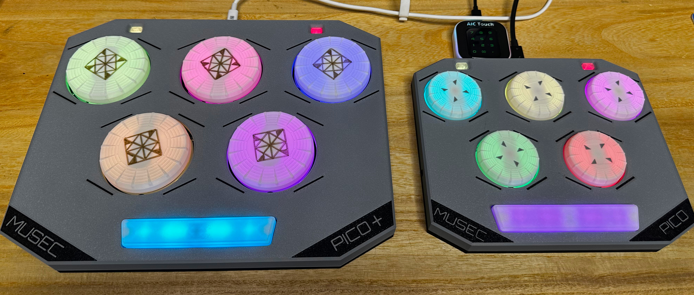

# Musec Pico - MUSECA 风格的迷你控制器
[Click here for the English version of this guide.](README.md)

特性:
* 它很小，但尽量还原街机控制器的感觉。
* 内置 "空格键" 踏板。
* 可以通过 3.5mm 插孔连接外部踏板。
* 完整的 HID 灯光支持。
* 命令行配置。
* 所有源文件开放。

感谢许多尊敬的爱好者和公司将他们的工具或材料免费或开源（KiCad，OnShape，InkScape，Raspberry 相关工具, 嘉立创，等）。

特别感谢社区项目和开发者的帮助，还有如下项目：
* RP_Silicon_KiCad: https://github.com/HeadBoffin/RP_Silicon_KiCad
* Type-C: https://github.com/ai03-2725/Type-C.pretty

## 其他项目
你也可以查看我其他的酷炫项目。

* Popn Pico: https://github.com/whowechina/popn_pico
* IIDX Pico: https://github.com/whowechina/iidx_pico
* IIDX Teeny: https://github.com/whowechina/iidx_teeny
* Chu Pico: https://github.com/whowechina/chu_pico
* Mai Pico: https://github.com/whowechina/mai_pico
* Diva Pico: https://github.com/whowechina/diva_pico
* AIC Pico: https://github.com/whowechina/aic_pico
* Groove Pico: https://github.com/whowechina/groove_pico
* Musec Pico: https://github.com/whowechina/musec_pico

这个 Musec Pico 项目：
* 大量依赖 3D 打印，所以你需要一个 3D 打印机。
* 需要具备焊接细小元器件的能力。

## **声明** ##
我在个人时间内制作了这个项目，没有任何经济利益或赞助。我将继续改进这个项目。我已尽我所能确保所有内容的准确性和功能性，但总有可能出现错误。如果你因使用这个开源项目而造成时间或金钱的损失，我不能负责。感谢你的理解。

## 关于许可证
它是 CC-NC 授权。所以你只能给自己和你的朋友 DIY，不能利用这个项目赚钱，比如收费的代做，出售整机等，连源作者都不敢提的抄袭或者稍微改改换个名字来打擦边球就更不可以了。注意团购和拼单订购原始元器件是合理的，非盈利的方式卖掉剩余的元器件也是可以接受的。

如果希望商用授权或者购买成品（可能较慢），请联系我（Discord，QQ 群，微信群或者在 issue 区留下你的联系方式）。

## 我的 Discord 服务器邀请
https://discord.gg/M8f2PPQFEA

## 如何制作
### PCB 和元器件
* 去 JLCPCB 下单，使用最新的 `Production\PCB\musec_main_xxx.zip` 和 `Procution\PCB\musec_pedal_xxx.zip` 里的 gerber 文件，选择常规 FR-4 板材，黑色或白色，**1.6mm** 厚度。
  
* 1x Rasberry Pico Pi Pico 或者兼容的克隆板（U1）。  
  https://www.raspberrypi.com/products/raspberry-pi-pico
* 1x USB Type-C 插座 (918-418K2023S40001 或 KH-TYPE-C-16P)
* 28x WS2812B-3528 RGB LED（板上所有 RGB LED）。
* 6x TMAG5273A1 或 TMAG5273A2, SOT23-6 封装（U3 到 U7）。
* 12x 0603 0.1uF 电容（0.1~1uF 都可以）（板上所有电容）。
* 2x 0603 5.1kohm 电阻（R1, R2）用于 USB。
* 2x 0603 10ohm 电阻（1-20ohm 都可以）（R3, R4）。
* 2x PJ-313 3.5mm 音频插口直插插座（J2, J3）。
* 12x JST-SH1.0 4P 贴片插座（JA1 到 JA5, JB1 到 JB5, Pedal, 踏板板上的 J1）。  
  https://www.amazon.com/Kidisoii-Connector-Mounting-Vertical-SH1-0-SMT-Ver/dp/B0CXMZ3J1Y?th=1
* 6x JST-SH1.0 双头 4P 电线，50-100mm 长度（55-60mm 最佳）。
  PCB 上的连接器封装也支持手工焊接。所以如果你找不到连接器或电线，你可以直接将导线焊接到 PCB 上。
  航模类网店通常有 SH1.0 4P 硅胶线，但一般只有一个头有连接器。你可以将另一端连接器焊接到 PCB 上，仍旧是一个不错的选择。
* 7x 凯华巧克力 v1 矮轴，重力版本（70gf），我认为黄色 70g 的是最合适的。
  
* 1x MX 兼容机械键轴，我个人使用佳达隆的 POM CJ BOX。
* 1x 配套 MX 键盘轴用的 6.25U 的钢板卫星轴（平衡杆）。  
  https://www.amazon.com/GATERON-Stabilizer-Mechanical-Keyboard-Satellite/dp/B0C137DG5Q/

* 焊接完成后的效果。  
    
  
* 注意这两个引脚的焊接，很容易疏忽，要么忘记焊，要么在过程中留下气泡。为了避免这种情况，从孔的一侧开始慢慢焊接，要用尽量少的焊丝和较多的助焊剂。  
  

### 测试 PCB
* 现在你可以测试 PCB 了，把固件烧录进去。
* 所有 RGB LED 应该会呈现彩虹效果。
* 按键按下时 LED 会有反应。
* Musec Pico 应该被识别为 USB HID 设备，这里是测试页面。  
  https://greggman.github.io/html5-gamepad-test/
* 将磁性螺丝刀头靠近 TMAG5273 传感器，你会看到测试页面上对应的轴会有反应。所有 5 个传感器都要试一下。

### 传感器 PCB 分离
* 如果一切正常，你可以把 5 个小传感器板从主板上切下来（甚至直接掰下来）。  
  

### 3D 打印
#### 打印参数  
* PLA 或 PETG.
* 层高: 0.2mm
* 支撑: 总是需要。
* 热床上涂胶水: 是的，可以防止角部翘曲。
* 文件都是以毫米为单位，不是英寸。

#### 5x 转盘按钮部分

* 键帽: `Production\3DPrint\musec_pico_keycap.stl`，白色，5 层墙或者 90% 以上填充率。如果你有多色打印系统，可以用灰色打印顶部的 4 个三角标记。
* 轴承固定器: `Production\3DPrint\musec_pico_bearing_fixer.stl`，透明。
* 轴端: `Production\3DPrint\musec_pico_shaft_end_xxx.stl`，透明，选择与你的磁铁大小匹配的那个。
* 平衡杆: `Production\3DPrint\musec_pico_lever.stl`，透明。
* 按键托底: `Production\3DPrint\musec_pico_pad.stl`，白色，灰色或黑色（这样不干扰 LED 的颜色）。

#### 外壳部分
* 外壳底部: `Production\3DPrint\musec_pico_bottom.stl`，黑色，使用专门的支撑材料以获得更好的螺丝孔表面。
* 外壳顶部: `Production\3DPrint\musec_pico_top.3mf`，灰色，倒置打印。如果你有多色系统，用黑色打印标志和线条。

#### 其他部分
* 踏板: `Production\3DPrint\musec_pico_pedal.stl`，白色，倒置打印。
* 辅助按键: `Production\3DPrint\musec_pico_aux.stl`，透明，倒置打印。

### 组装
#### 需要的其他部件
* 5x **M2.5\*6mm 螺丝** 用于将键帽固定到轴承上。
* 30x **M2\*(6-8mm) 螺丝** 用于将轴承和传感器 PCB 固定到平衡杆上。
* 15x **M3\*8mm 螺丝** 用于将按键托底固定到底壳上。
* 16x **M3\*(10-12mm) 螺丝** 用于将顶壳和底壳以及踏板板固定到底壳上。
* 5x 6700zz (10x15x4mm) 轴承用于转盘，买最便宜的就行。  
  https://www.amazon.com/uxcell-6700ZZ-Groove-Bearings-Shielded/dp/B082PPYZQX/
* 5x 圆形磁铁，直径 5-7mm（3mm 或 4mm 也可以，只要你有办法粘住就好），高度 1.5mm 或 2mm，必须是径向/直径磁化的（N-S 极在弧面一侧）。  
  https://wargameportal.com/products/special-diametrically-magnetized-50pcs-5mm-x-2mm-3-16-x-1-16-disc-magnets?variant=49014932209942
* 5x 长 25mm 直径 2mm 的钢轴用于平衡杆。  
  https://www.walmart.com/ip/Unique-Bargains-RC-Toy-Car-Frame-Part-Stainless-Steel-Round-Rod-Shaft-25mm-x-2mm-40-Pcs/108734138?wmlspartner=wlpa&selectedSellerId=571
* 一些好的胶带（如醋酸胶带或高温聚四氟乙烯胶带）用于固定磁铁。
* 用于滑动表面的 PTFE 或 UHMW 胶带。
* 底部的硅胶防滑垫。  
  
* 可选，但很有用：数字钢琴或音乐键盘的延音踏板或带有 3.5mm 插孔的缝纫机踏板。如果带的是 6.25mm 插头，那你还需要一个 6.25mm 到 3.5mm 的转接头。

#### 步骤
1. 我们从转盘部分开始。  
   

2. 将轴承放入轴承固定器中，你需要稍微弯曲固定器才能将轴承插入。不用担心固定器的小连接部分断裂，没关系的。然后将轴承固定器螺丝到平衡杆上。  
   

3. 使用 M2.5 螺丝将键帽固定到轴承上。  
   

4. 现在将磁铁插入到中心的槽中。它会被螺丝头吸住，但我们仍然需要一些胶带来固定它。  
   

5. 用螺丝将传感器 PCB 固定到平衡杆上，并在表面上贴一小片薄的 PTFE/UHMW 胶带。最后将轴插入到平衡杆上。  
  

6. 使用 5 条 SH1.0 电线连接到主 PCB。将主 PCB 和踏板 PCB 安装到底壳上。使用另一条 SH1.0 电线将踏板 PCB 和主 PCB 连接起来。踏板板上的螺孔是可调的。一般来说你需要将踏板 PCB 靠上一点安装。  
  

7. 将已经连接到主板的 SH1.0 电线连接到传感器 PCB 上。然后将杆轴推入底壳上的支架。如果你有键盘润滑剂，你可以涂一些在轴和支架上。  
     
   可选：一对塑料垫片将有助于防止平衡杆移动，合适的厚度是 0.5mm，内径是 2.1~2.5mm，外径是 5-10mm。  
    
    

8. 使用 M3\*8mm 螺丝将按键托底固定。  
  

9. 装上外壳顶部，你需要拧很多 M3 螺丝。  
  

10. 在底部装上防滑垫，直接遮住螺丝。

#### 特别注意
* 不同的 3D 打印机和打印材料有不同的公差。如果你发现踏板键帽上的轴孔太紧，用针或刀片稍微扩大一点。
* 螺丝很容易将 3D 打印件弄坏。所以不要拧得太紧。当你发现阻力突然增大时，就该停止拧了。

### 固件
* UF2 文件在 `Production\Firmware` 文件夹中。
* 对于新的固件，按住 BOOTSEL 按钮连接到 USB，会出现一个名为 "RPI-RP2" 的磁盘。将 UF2 固件二进制文件拖入其中。就这样。Musec Pico 的底部有一个小孔，它正对着 BOOTSEL 按钮。
* 如果已经烧录过 Musec Pico 固件，你可以使用命令行中的 "update" 或者在插入 USB 的时候按住至少 4 个按钮来进入更新模式。
* 要访问命令行，你可以使用这个 Web 串口终端连接到 Musec Pico 的 USB 串口。（注意："?" 是帮助）  
  https://googlechromelabs.github.io/serial-terminal/

### 使用
* 它非常简单。只需插入并使用。
* 你可以通过 "spin rate" 命令设置按钮旋转的灵敏度。
* 开机时固件会识别外部踏板的极性。按住 Aux 和内置踏板来重新识别极性。

## CAD 源文件
我使用的是 OnShape 的免费订阅。它很强大，但不能将原始设计存档到本地，所以我只能在这里分享链接。STL/DXF/DWG 文件是从这个在线文档导出的。  
  https://cad.onshape.com/documents/841383e62eb719d8b384c2c8/w/8c9b3131eb80c219de824619/e/8a5d9f0dffe483e0bce3630a
